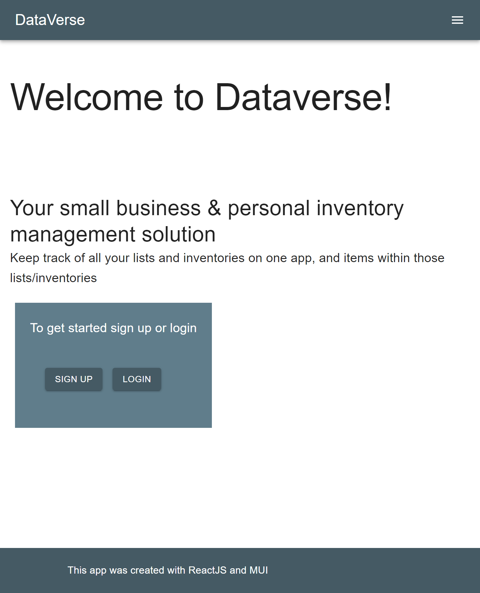
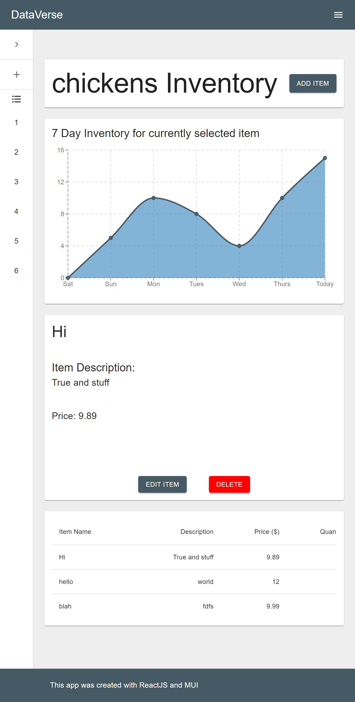

# DataVerse

A scalable app used for personal to small business inventories.

## Technologies Used

- ReactJS
- MUI
- Node.js
- Express.js
- Apollo / Graphql
- Mongoose
- Recharts

## Future Features

- Searching for items, lists, and users.
- Account Page
- The ability to add other users to your lists
- Users added to your list will be able to add and manage your shared list

## Bugs / Known Issues

- Dashboard mobile view
- Chart is a work in progress, need to update server item model to save dates in array
- Homepage is a work in progress, needs to be visually updated
- Edit button in Dashboard won't hold current item values, must retype parts you don't wanna change

## Team Memebers and Contributers

- [Boedi Lofland](https://github.com/blofland)
- [Elia Brown](https://github.com/browneli003)
- [Michael "Heff" Heffron](https://github.com/Shmikester)
- [Nelson de Carvalho](https://github.com/NelsondeCarvalho)
- [Sean Dillon](https://github.com/Sdillon215)
- [Victor L Perez](https://github.com/Zunaty)

## References

- [MUI](https://mui.com/)
- [ReactJS](https://reactjs.org/)
- Bootcamp Modules

## Site Link and Preview

[Site Link](https://gentle-temple-58806.herokuapp.com/)

### License Link

[MIT License](https://choosealicense.com/licenses/mit/)

### MIT License Text

MIT License

Copyright (c) 2021 DataVerse

Permission is hereby granted, free of charge, to any person obtaining a copy
of this software and associated documentation files (the "Software"), to deal
in the Software without restriction, including without limitation the rights
to use, copy, modify, merge, publish, distribute, sublicense, and/or sell
copies of the Software, and to permit persons to whom the Software is
furnished to do so, subject to the following conditions:

The above copyright notice and this permission notice shall be included in all
copies or substantial portions of the Software.

THE SOFTWARE IS PROVIDED "AS IS", WITHOUT WARRANTY OF ANY KIND, EXPRESS OR
IMPLIED, INCLUDING BUT NOT LIMITED TO THE WARRANTIES OF MERCHANTABILITY,
FITNESS FOR A PARTICULAR PURPOSE AND NONINFRINGEMENT. IN NO EVENT SHALL THE
AUTHORS OR COPYRIGHT HOLDERS BE LIABLE FOR ANY CLAIM, DAMAGES OR OTHER
LIABILITY, WHETHER IN AN ACTION OF CONTRACT, TORT OR OTHERWISE, ARISING FROM,
OUT OF OR IN CONNECTION WITH THE SOFTWARE OR THE USE OR OTHER DEALINGS IN THE
SOFTWARE.